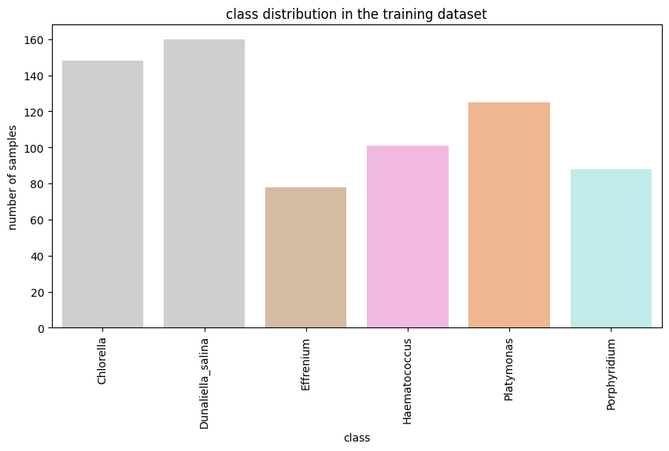
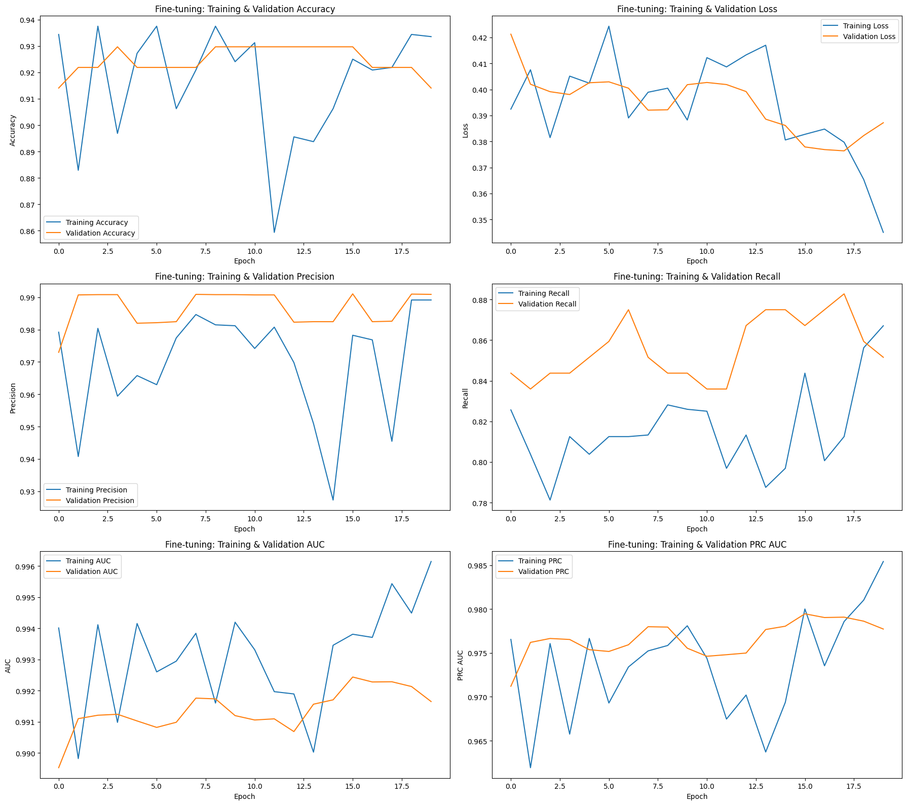

# AlgaeNet: Algae Classification with InceptionV3

## Project Overview

This project implements a deep learning model to classify different types of algae based on image data. The model utilizes the InceptionV3 architecture, pre-trained on ImageNet, and fine-tuned for the specific algae dataset.

## Data Preparation and Creation

The dataset preparation involves organizing raw image and label data into a structured format suitable for training a deep learning model. This process is handled by the `algaenet/cnn_model/data_creation.ipynb` notebook.

**1. Initial Data Organization (Training Set):**
    *   **Base Directory:** Raw data is located in `algaenet/dataset/train`.
    *   **Image and Label Folders:** Contains an `images` folder (e.g., `.jpg` files) and a `labels` folder (e.g., `.txt` files, like `algaenet/dataset/train/labels/00316.txt`). Each label file corresponds to an image file.
    *   **Class Mapping:** A predefined mapping in `data_creation.ipynb` (see cell with `class_names = {0: "Platymonas", ...}`) links class IDs from label files to class names.
    *   **Creating Class Subdirectories:** For each class, a subdirectory is created within `algaenet/dataset/train/images` (e.g., `algaenet/dataset/train/images/Platymonas`).
    *   **Processing Labels and Moving Images:**
        *   The `data_creation.ipynb` script iterates through label files.
        *   It reads the class ID.
        *   The corresponding image is moved from the root `images` folder to its class subdirectory.
        *   Output from `data_creation.ipynb` (e.g., "moved 0 images", "skipped 700 images") indicates the outcome of this process. The file counts per class (e.g., "Chlorella contains 148 files") are also logged.

**2. Creating the Validation Set:**
    *   **Source:** Organized training images from `algaenet/dataset/train/images`.
    *   **Destination:** `algaenet/dataset/val/images`.
    *   **Splitting Percentage:** 20% of images from each training class are used for validation (defined by `validation_split_percentage = 0.20` in `data_creation.ipynb`).
    *   **Copying Images:**
        *   Images are randomly selected and copied to corresponding class subdirectories in `algaenet/dataset/val/images`.
        *   The `data_creation.ipynb` notebook logs the number of images copied per class (e.g., "copied 29 images to algaenet/dataset/val/images/Chlorella").

**3. Test Set:**
    *   Located in `algaenet/dataset/test`. The `algaenet/cnn_model/model_2.ipynb` notebook loads test images from this directory.

**Final Structure for `ImageDataGenerator`:**
```
algaenet/
└── dataset/
    ├── train/
    │   └── images/
    │       ├── Chlorella/
    │       │   ├── img1.jpg
    │       │   └── ...
    │       └── ... (other classes based on data_creation.ipynb class_names)
    ├── val/
    │   └── images/
    │       ├── Chlorella/
    │       │   ├── img3.jpg
    │       │   └── ...
    │       └── ... (other classes)
    └── test/
        └── images/ (or class subdirectories)
            ├── test_img1.jpg
            └── ...
```

## Model Architecture

The model uses the InceptionV3 architecture as a base (defined in `algaenet/cnn_model/model_2.ipynb`):
1.  **Base Model:** InceptionV3 pre-trained on ImageNet, top layer removed. Input shape: (75, 75, 3).
2.  **Freezing Layers:** Initial layers of the base model are frozen.
3.  **Custom Head:**
    *   GlobalAveragePooling2D
    *   Dense (256 units, ReLU)
    *   Dropout (0.2)
    *   Dense (6 units - number of classes, softmax)

## Training

The model is trained in two phases within `algaenet/cnn_model/model_2.ipynb`:

1.  **Initial Training:**
    *   Data: `train_generator` from `algaenet/dataset/train/images`.
    *   Optimizer: Adam (learning rate 0.0001).
    *   Loss: Categorical Crossentropy.
    *   Metrics: Accuracy, Precision, Recall, AUC, PRC.
    *   Epochs: 100.
    *   Class weights (`class_weight_dict`, visualized by a bar plot in `model_2.ipynb`) are applied.
    *   Model saved: `../results/inceptionv3_model.h5`.
    *   History saved: `../results/inceptionv3_history.csv`.

2.  **Fine-Tuning:**
    *   Model: Loaded `../results/inceptionv3_model.h5`.
    *   Data: `train_generator` and `validation_generator` (from `algaenet/dataset/val/images`).
    *   Optimizer: Adam (learning rate 0.00005).
    *   Epochs: 20.
    *   Class weights applied.
    *   Model saved: `../results/inceptionv3_finetuned_model.h5`.
    *   History saved: `../results/inceptionv3_finetune_history.csv`.

## Evaluation and Results

Performance is monitored using metrics plotted in `algaenet/cnn_model/model_2.ipynb`.

*   **Class Distribution in Training Data:**
    *   A count plot shows the number of samples per class.
     

*   **Class Weight Distribution:**
    *   A bar plot shows the calculated weights for each class.
     

*   **Training Performance Plots:** (Generated from `inceptionv3_history.csv`)
    *   Visualizations of Loss, Accuracy, Precision, Recall, AUC, PRC over epochs.
     

*   **Fine-Tuning Performance Plots:** (Generated from `inceptionv3_finetune_history.csv`)
    *   Visualizations of Training & Validation metrics (Accuracy, Loss, Precision, etc.) over epochs.
    

*   **Test Predictions Visualization:**
    *   The fine-tuned model predicts on the test set. Sample images with predicted classes are displayed.
     
## How to Use

1.  **Setup:**
    *   **Create and Activate Virtual Environment (Recommended):**
        ```bash
        python -m venv venv
        .\venv\Scripts\activate  # On Windows
        # source venv/bin/activate  # On macOS/Linux
        ```
    *   **Install Dependencies:** Ensure Python is installed, then install required libraries:
        ```bash
        pip install -r algaenet/requirements.txt
        ```
    *   **Prepare the Dataset:**
        *   Run `algaenet/cnn_model/data_creation.ipynb` to structure `train` and `val` directories.
        *   Ensure the `test` directory is populated.
2.  **Run the Model Training Notebook:**
    *   Execute cells in `algaenet/cnn_model/model_2.ipynb`.
3.  **Results:**
    *   Models are in `../results/`.
    *   History CSVs are in `../results/`.
    *   Plots are displayed in the notebook and can be saved (example images in `./public/`).

## Files

*   `algaenet/cnn_model/model_2.ipynb`: Main notebook for model training and evaluation.
*   `algaenet/cnn_model/data_creation.ipynb`: Notebook for dataset structuring.
*   `algaenet/requirements.txt`: Project dependencies.
*   `../results/inceptionv3_model.h5`: Initial trained model.
*   `../results/inceptionv3_history.csv`: History of initial training.
*   `../results/inceptionv3_finetuned_model.h5`: Fine-tuned model.
*   `../results/inceptionv3_finetune_history.csv`: History of fine-tuning.
*   `./public/`: Folder containing example output images.
    *   `input.png`, `input2.png`: Example plots of data characteristics.
    *   `output.png`, `output2.png`, `output3.png`: Example plots of training/evaluation results.
